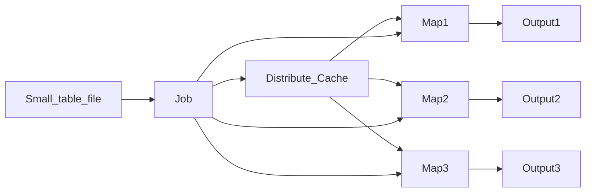

# MR实现关联操作

## 需求案例

MR的关联操作就是SQL中的JOIN操作,假设有两种存放在HDFS上的两张表:

订单表:

| 订单ID | 用户ID | 商品ID |
|:-----:|:------:|:-----:|
| 100234 | 23942 | 209304 |
| 100235 | 24563 | 248793 |
| 100453 | 25634 | 248793 |
| 100587 | 28867 | 285760 |

商品表:

| 商品ID | 商品名称 | 商品价格 |
|:-----:|:------:|:-----:|
| 209304 | Python入门 | 299 |
| 248793 | 跟我一起学PPT | 29 |gf
| 285760 | 大数据开发 | 599 |

最后需要得到一个商品详情表:

| 订单ID | 用户ID | 商品ID | 商品名称 |
|:-----:|:------:|:-----:|:-------:|
| 100234 | 23942 | 209304 | Python入门 |
| 100235 | 24563 | 248793 | 跟我一起学PPT |
| 100453 | 25634 | 248793 | 跟我一起学PPT |
| 100587 | 28867 | 285760 | 大数据开发 |

## Map Join

- 将关联的其中的一个文件(小文件)放到分布式缓存,将关联的ID作为Key值存为HashMap.

- 将关联中的另一个文件(大文件)划分到各个Map,每个Map里访问分布式缓存,根据关联的ID获取相应的数据.

![MapJoin示意图][1]

- MR启动时可以将HDFS上的小文件放到分布式缓存中,也就是Distribute Cache中.

- 大文件会被分成一个个数据分片由多个Map进行处理.

- 每个Map都会访问分布式缓存中的数据,然后在Map中将两个表关联起来.

- 最后直接输出结果.

问题:但是如果关联的两个表都比较大,这种方法容易导致内存溢出.

改进措施:根据MR的特性,将两个表相同的需要关联的Key值分配到同一个节点上进行关联.

## Reducer Join

- 将两个关联的文件都划分到各个Map中,并对每一条数据打上属于哪个关联文件的标记,然后将关联的ID作为Map输出的Key值传给Reduce端,这样一来,两张表中相同的key值就会分配到同一个Redece端.

- 在Reduce端将相同的Key值的数据关联起来.

![Reduce Join][2]

## 一对多关联的优化

- 使用二次排序,对数据表标识符排序,避免将数据多的那张表的数据缓存在内存中.减少内存使用,避免OOM(Out of Memory)

![一对多关联优化][3]

## 问题

多对多场景下,如果也这样进行二次排序的话,会不会使程序也能得到优化呢?

我觉得能优化一点吧,应为多对多嘛,二次排序后可以缓存较少的那个表信息,然后与其他的表进行关联操作.相对于不进行二次排序,直接缓存第一个数据中相关的表信息,会起到一定的优化作用.当然如果两个表大小相等,那么二次排序是不能起到任何优化作用的,甚至应为排序耗费了一定资源会起到相反的作用.(个人见解,不知道对不对.)

## 总结

- Map Join

    适用于小表关联大表,运行效率高

- Reduce Join

    通用关联方法,可能发生数据倾斜.

[1]: https://github.com/jiaoqiyuan/163-bigdate-note/raw/master/%E6%97%A5%E5%BF%97%E8%A7%A3%E6%9E%90%E5%8F%8A%E8%AE%A1%E7%AE%97%EF%BC%9AMR/img/MapJoin%E7%A4%BA%E6%84%8F%E5%9B%BE.png
[2]: https://github.com/jiaoqiyuan/163-bigdate-note/raw/master/%E6%97%A5%E5%BF%97%E8%A7%A3%E6%9E%90%E5%8F%8A%E8%AE%A1%E7%AE%97%EF%BC%9AMR/img/ReduceJoin%E7%A4%BA%E6%84%8F%E5%9B%BE.png
[3]: https://github.com/jiaoqiyuan/163-bigdate-note/raw/master/%E6%97%A5%E5%BF%97%E8%A7%A3%E6%9E%90%E5%8F%8A%E8%AE%A1%E7%AE%97%EF%BC%9AMR/img/%E4%B8%80%E5%AF%B9%E5%A4%9A%E5%85%B3%E8%81%94%E4%BC%98%E5%8C%96.png

