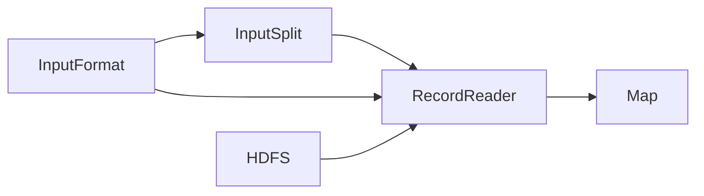

# MR程序的输入

- Java程序如何读取文件数据

    FileInputStream将文件流读出来。

- Map中的Key/Value从何而来？

    由InputFormat生成，默认的是TextInputFormat。
    
    使用HDFS的FSDataInputFormat读文件。

## InputFormat

```java
public abstract class InputFormat<K, V> {

  /** 
   * Logically split the set of input files for the job.  
   */
  public abstract 
    List<InputSplit> getSplits(JobContext context
                               ) throws IOException, InterruptedException;
  
  /**
   * Create a record reader for a given split. The framework will call
   */
  public abstract 
    RecordReader<K,V> createRecordReader(InputSplit split,
                                         TaskAttemptContext context
                                        ) throws IOException, 
                                                 InterruptedException;
}
```

- getSplits()获取所有分片，每个分片对应一个map。所以说这里将数据分成了多少篇就决定了后期会启动多少个map任务。

- createRecordReader()获取RecordReader对象，该对象负责读取一个分片的数据，并生成Kye/Value给Map函数。

- getSplits()在客户端运行，createRecordReader()在各个执行节点运行。

## InputSplit

```java
public abstract class InputSplit {
  /**
   * Get the size of the split, so that the input splits can be sorted by size.
   */
  public abstract long getLength() throws IOException, InterruptedException;

  /**
   * Get the list of nodes by name where the data for the split would be local.
   * The locations do not need to be serialized.
   */
  public abstract 
    String[] getLocations() throws IOException, InterruptedException;
  
  /**
   * Gets info about which nodes the input split is stored on and how it is
   * stored at each location.
   */
  @Evolving
  public SplitLocationInfo[] getLocationInfo() throws IOException {
    return null;
  }
}
```

- Split中不包含数据，只包含了指向这个数据的引用。

- getLength()返回该数据分片的数据量。MR根据这个分片的数据量进行排序，有限处理大的数据分片。

- getLocations()返回数据分片所存在的位置，即一组主机名。

- 在自定义的Split中，重要的是定义好能找到这个让分片的数据的所有信息。

## RecordReader

```java
public abstract class RecordReader<KEYIN, VALUEIN> implements Closeable {

  /**
   * Called once at initialization.
   * @param split the split that defines the range of records to read
   * @param context the information about the task
   * @throws IOException
   * @throws InterruptedException
   */
  public abstract void initialize(InputSplit split,
                                  TaskAttemptContext context
                                  ) throws IOException, InterruptedException;

  /**
   * Read the next key, value pair.
   * @return true if a key/value pair was read
   * @throws IOException
   * @throws InterruptedException
   */
  public abstract 
  boolean nextKeyValue() throws IOException, InterruptedException;

  /**
   * Get the current key
   * @return the current key or null if there is no current key
   * @throws IOException
   * @throws InterruptedException
   */
  public abstract
  KEYIN getCurrentKey() throws IOException, InterruptedException;
  
  /**
   * Get the current value.
   * @return the object that was read
   * @throws IOException
   * @throws InterruptedException
   */
  public abstract 
  VALUEIN getCurrentValue() throws IOException, InterruptedException;
  
  /**
   * The current progress of the record reader through its data.
   * @return a number between 0.0 and 1.0 that is the fraction of the data read
   * @throws IOException
   * @throws InterruptedException
   */
  public abstract float getProgress() throws IOException, InterruptedException;
  
  /**
   * Close the record reader.
   */
  public abstract void close() throws IOException;
}

```

- Map在运行时，会先调用nextKeyValue()方法，生成下一个Key/Value键值对，然后调用getCurrentKey()和getCurrentValue()从RecordReader中获取相应的值.

## 整体结构



```
InputFormat: getSplits(), createRecordReader()
RecorderReader: newxKeyValue(), getCurrentKey(), getCurrentValue()
Map:Key/Value
```

- InputFormat中提供的getSplits()返回一个InputSplit列表，createRecordReader()返回一个ReocrdReader。

- InputSPlit中包含这个数据的分片信息。

- RecordReader将这些分片信息读取出来，然后从HDFS上找到相应的数据源。

- 找到数据源后调用newxKeyValue对数据源进行遍历，遍历过程中将Key值和Value值交给Map进行处理。

## FileInputFormat如何进行分片

- 通常情况下会将文件中的一个块或多个块放在一起作为一个分片，但是分片不允许跨文件。

- 如果文件比较小，则一个文件就对应一个分片。

- 如果存在大文件，则分片通常与HDFS的块大小一样。

- 分片计算公式：

  ```
  max(minimumSize, min(maximumSIze, blockSize))
  其中:
  minimumSize = mapreduce.input.fileinputformat.split.maxsize
  maximumSize = mapreduce.input.fileinputformat.splie.minsize
  ```
  minimumSize不要超过块大小，因为这样会将一个或多个块的数据分配到一个map中去，这样会产生大量网络开销，牺牲了MR的数据本地性这个特性。

## 小文件与CombineFileInputFormat

- 如果文件比较小，一个文件对应一个map，如果有大量小文件，会产生大量map，但是每个map的计算量很小，严重浪费集群资源。

- CombineFileInputFormat将小文件合并到一个map中，避免资源浪费。