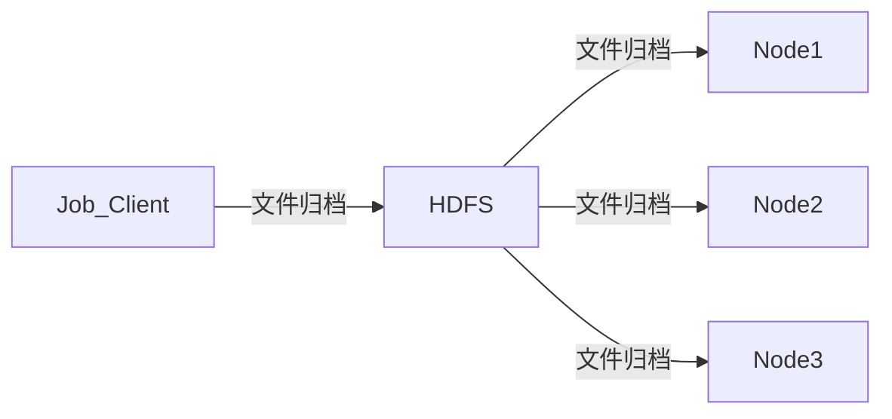

# 灵活应用Configuration

## Job配置

- 每个MR任务都必须由一个Configuration对象初始化，这个对象管理整个任务的参数。任务执行过程中的所有参数都从这个对象中获取。

- Configuration其实就是Key/Value结构的数据，管理着所有参数。

- Configuration是Writable对象，可以被序列化，并创送到各个节点。

- 由Job在客户端进行配置，然后有由MR框架传送到各个节点上供MR使用。

- Mapper和Reducer之间不能传递参数，如果在Mapper端设置Configuration参数，那么在Reducer端是无法获取到这个参数的。

    ```mermaid
    graph LR;
    Job-->|Configuration|Mapper;
    Job-->|Configuration|Redecer;
    ```

## Configuration加载顺序

new Configuration()时发生了什么？

在客户端的hadoop-current/etc/hadoop目录下有一些xml文件，在new 一个Configuration时会加载这些配置文件：

1. 加载默认配置文件*-default.xml

2. 加载site级别的配置文件*-site.xml

3. 加载Configuration对象的set方法设置的参数，以及自定义的配置文件。

MR中的配置参数分两种：一种是不可覆盖的，一种是可覆盖的。

- 不可覆盖的参数即使你在Configuration中使用set设置了新的值也是无法覆盖原来的参数值的。

- 可覆盖的参数也成为自定义参数，后配置的参数值会覆盖前面配置的参数值。

- 自定义的配置文件放在classpath指定的路径下，一般打在jar包里。

## 分布式缓存

- Hadoop可以将Configuration配置信息传递到Map和Reduce端，那么自定义个配置文件是否也可以这样传输呢？用分布式缓存可以实现！

- **当用户启动一个作业，Hadoop会把-files -archives和-libjars上传到HDFS，然后再将文件复制到各个执行节点上。**  

- Java中可以使用addCacheFile将用户自定义的配置文件上传到分布式缓存上，在各个执行节点只需要使用文件名就可以访问这些文件。


## 实操

MR中的Configuration和分布式缓存在实际案例中是如何运用的。

